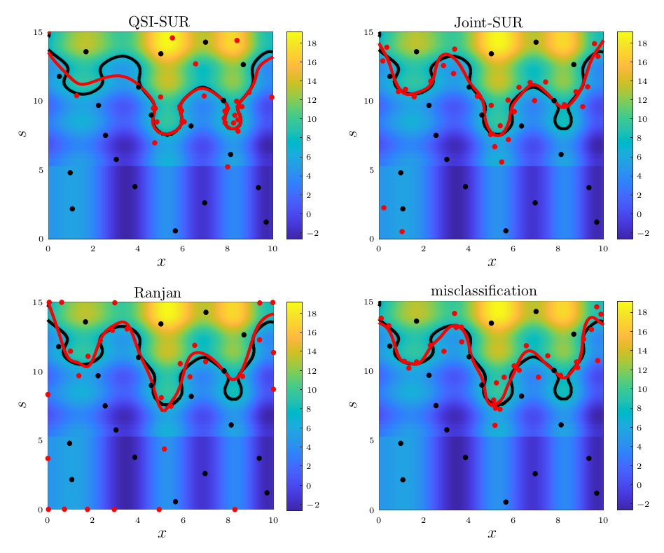

# qsi-paper-experiments

This repository contains data and scripts used for the numerical
experiments of the article:

Romain Ait Abdelmalek-Lomenech (†), Julien Bect  (†),
Vincent Chabridon (§) and Emmanuel Vazquez  (†)  
__Bayesian sequential design of computer experiments for quantile set
inversion__ ([arXiv:2211.01008](https://arxiv.org/abs/2211.01008))

(†) Université Paris-Saclay, CNRS, CentraleSupélec,
[Laboratoire des signaux et systèmes](https://l2s.centralesupelec.fr/),
Gif-sur-Yvette, France.  
(§) EDF R&D, Chatou, France

## Requirements

### Matlab

Most of the numerical experiments of the article were carried out
using Matlab.  To reproduce the figures, or run the entire bnchmark
from scratch, you will need:

* some reasonably recent version of Matlab (R2022a was used to produce
  the results included in the article),
* version 2.8.1 of the [STK toolbox](https://github.com/stk-kriging/stk/),
* and the [contrib-qsi](https://github.com/stk-kriging/contrib-qsi)
  repository.

Both STK 2.8.1 and the contrib-qsi repository will be automatically
cloned the first time you start Matlab from the root of this project.
(See [startup.m](startup.m) for details.)

### Python

Python is only required to reproduce the results concerning the ECL
algorithm of [Cole et al (2023)](https://doi.org/10.1080/00224065.2022.2053795).
More precisely, you will need:

* some reasonably recent version of Python 3 (version 3.11.2 was
  used to produce the results included in the article),
* the [virtual-env](https://pypi.org/project/virtualenv/) package.

Before running the ECL-related experiments, you have to run the shell script
[algorithms/gramacylab-nasa/ecl-setup.sh](algorithms/gramacylab-nasa/ecl-setup.sh),	
which will carry out the following step:

1. Clone the [ECL repository](https://bitbucket.org/gramacylab/nasa).
2. Apply [a patch](algorithms/gramacylab-nasa/ecl.patch)
   to adapt it for the QSI paper expriments.
3. Create a python virtual environment at the root of the repository
   (using virtualenv) & install the
   [required packages](algorithms/gramacylab-nasa/requirements.txt).

If your OS cannot run shell scripts, you can of course carry out these
operations manually (see shell script for details).

## Demonstration script

The script `scripts/demo_qsi.m` provides a live demonstration of the
QSI-SUR strategy on the synthetic function `f_1`, by generating a
random initial design and displaying, every 3 steps, the points chosen
by the sampling criterion.  To run it:

1. Start Matlab from the root of this project.  This will trigger the
   [startup.m](startup.m) script, which configures everything automtically.
2. Type `demo_qsi` in the prompt to start the demonstration.

## Reproducing the figures and experiments from the article

### Saved data

All the results used or displayed in the article and its supplementary
materials (sequential/initial designs, estimated covariance
parameters, graphs...) and the associated data are saved in the `data`
directory.

### How to reproduce the figures from saved data

The figures displayed in the article can be reproduced, using the data
stored in `data/`, by launching the scripts in `scripts/figures`:
- `Figure_i.m` (with i = 1, 3, 6, 7) for the corresponding figure.
- `Figures_convergence.m` for the figures 4, 5, 9 and the ones
  displayed in the supplementary material, for a given function (by
  default, `f_1`).

### How to reproduce the benchmark results from scratch

Three scripts, located in `scripts/benchmark`, allow to reproduce the
experiments and the associated data:
- `matlab_experiments.m` constructs sequential designs using the
  QSI-SUR, Joint-SUR, Ranjan, max. misclassification and random
  satrategies.
- `ecl_experiments.py` constructs sequential designs using the ECL
  strategy.
- `results_computation.m` computes the proportion of misclassified
  points at each step for all the competitor strategies and saves the
  results in `data/results`.

By default, these scripts produces results for 100 runs, without using
parallel computing, for the synthethic test function `f_1`. The full
reproduction of the experiments used in the paper can take a (very)
long time, but this can be alleviate by reducing the number of runs,
activating parallel computing, or modifying the configuration file of
the considered test case (see next section).

More details on the sub-functions involved in thoses scripts can be
found in `algorithms/stk-contrib-qsi/README.md`.

## Test functions

### Naming

The test functions are named differently in the article and in the code.
The correspondance (paper ⮕ code) is as follows:
- `f_1` ⮕ `branin_mod`.
- `f_2` ⮕ `double_camel`.
- `f_3` ⮕ `hart4`.
- `Volcano` ⮕ `volcano`.

### Implementation details

Each test `function` (and associated QSI problem) is described by several files:
- `function.m` or `function.py`, the associated function either coded
  in matlab or python.
- `function_s_trnsf.m`, the inverse mapping associated to the
  probability distribution on the uncertain inputs.
- `function_struct.m`, describing the problem (threshold, critical
  region, input spaces...)
- `function_config.m`, a configuration file for the different
  matlab-implemented strategies (number of steps, size of the
  integration grid, number of candidates points...).

### Where to find them

Matlab implementation:
 * everything except the volcano case is located in
   [`algorithms/stk-contrib-qsi/test_functions`](https://github.com/stk-kriging/contrib-qsi/tree/main/test_functions).
 * the files for the volcano case are located in
   [`testcases/volcano-case`](testcases/volcano-case) and
   [`testcases/matlab`](testcases/matlab)

Python implementation:
 * Everything is in [`testcases/python`](testcases/python).

## Acknowledgements

The authors are grateful to Valérie Cayol and Rodolphe Le Riche for
sharing their R implementation of the Mogi model used for the Volcano
test case.  This work has been funded by the French National Research
Agency (ANR), in the context of the project SAMOURAI (ANR-20-CE46-0013).

## Copyright & license

Copyright 2024 CentraleSupélec

These computer programs are free software: you can redistribute them
and/or modify them under the terms of the GNU General Public License
as published by the Free Software Foundation, either version 3 of the
license, or (at your option) any later version.

They are distributed in the hope that they will be useful, but WITHOUT
ANY WARRANTY; without even the implied warranty of MERCHANTABILITY or
FITNESS FOR A PARTICULAR PURPOSE.  See the license for more details.

You should have received a copy of the license along with the software
(see [COPYING.md](./COPYING.md)).  If not, see <http://www.gnu.org/licenses/>.
